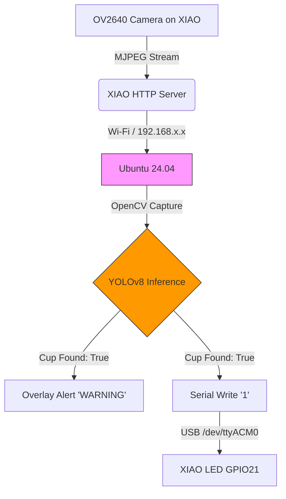

# Anti-Kuso-Joshi Project

# Anti-Kuso-Joshi Project 要件定義書

## 1. プロジェクト理念 (Philosophy)

本プロジェクトは、**「AIにおける情報主権の確立」** を旗艦目的とする。
ベンダーロックインと月額課金に支配された現代のAIソリューションに対し、個人が全てのデータとロジックを掌握できる「自己主権型パーソナルAI」の実現可能性を、動くコードで示す。

## 2. 開発・実行環境

### 2.1 ハードウェア構成

- **ホストPC**: Diginnos PC (Ubuntu 24.04 LTS)
- **エッジデバイス**: Seeed Studio XIAO ESP32S3 Sense
  - カメラ: OV2640
  - メモリ: 8MB PSRAM (OPI) / 8MB Flash
  - インジケータ: 内蔵ユーザーLED (GPIO 21)
- **インターフェース**: USB Type-C (給電・通信)

### 2.2 ソフトウェア構成

- **OS**: Ubuntu 24.04 LTS
- **言語・主要ライブラリ**: Python 3.11.9, OpenCV, PySerial
- **AI推論エンジン**: Ultralytics YOLOv8 (yolov8n.pt)
- **ビルド環境**: arduino-cli (完全CLI制御)

## 3. 機能要件 (Functional Requirements)

### 3.1 映像入力・ストリーミング

- **FR-01**: XIAO ESP32S3の内蔵カメラから低遅延でJPEG画像を取得すること。
- **FR-02**: 解像度は処理負荷と消費電力最適化のため「QVGA (320x240)」を基本とする。
- **FR-03**: Wi-Fiまたはシリアル通信経由で、Python側へ途切れのない映像ストリームを供給すること。

### 3.2 高度オブジェクト検知

- **FR-04**: 映像データは全てローカルで処理し、**1バイトたりとも外部クラウドに送信しない**こと。
- **FR-05**: YOLOv8を用い、COCOデータセットのクラスID: 41 (Cup) をロックオンすること。
- **FR-06**: 画面内にコップが検知されている状態を「自席集中モード」として判定すること。

### 3.3 リアルタイムアラート

- **FR-07**: コップの検知フラグ (`cup_found`) をトリガーとして、画面上に警告テロップを重畳表示すること。
- **FR-08**: 検知状態に応じて、シリアルコマンド (`b'1'` / `b'0'`) をエッジデバイスへ送信すること。
- **FR-09**: エッジデバイスはコマンドを受信し、内蔵LED (GPIO 21) を制御すること。

## 4. 非機能要件 (Non-Functional Requirements)

### 4.1 情報主権とセキュリティ

- **NFR-01**: 推論およびデータ保存は全てオンプレミス（Ubuntu PC内）で完結させること。
- **NFR-02**: カメラ映像や個人情報を含む如何なるデータも、外部ネットワークに流出させないこと。

### 4.2 堅牢性とエラーハンドリング

- **NFR-03**: エッジデバイスの瞬断に対し、ドライバー再初期化またはタイムアウトリトライ（1.5秒）で自動復旧を試みること。
- **NFR-04**: プロセス重複を防ぐため、ゾンビプロセスを強制終了する機構 (`pkill -9`) を組み込むこと。

### 4.3 コード品質・ポータビリティ

- **NFR-05**: `requirements.txt` により、全Python依存関係を一発で環境再現できること。
- **NFR-06**: `pre-commit` により、コミット前にコードスタイルとフォーマットが自動矯正されること。
- **NFR-07**: 認証情報（Wi-Fi SSID/PASS等）は `secrets/` フォルダで管理し、`.gitignore` でGit追跡から完全に遮断すること。

## 5. アーキテクチャ図 (概念)

